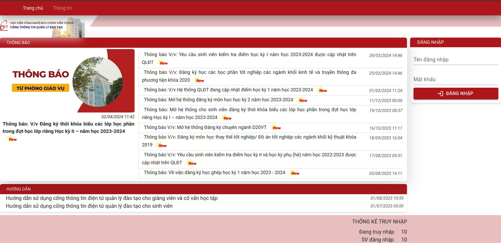

# Hệ Thống Cơ Sở Dữ Liệu Phân Tán - Dự Án Đăng Ký Tín Chỉ

## Mục Lục
- [Giới Thiệu](#giới-thiệu)
- [Tính Năng Hệ Thống](#tính-năng-hệ-thống)
- [Kiến Trúc Hệ Thống](#kiến-trúc-hệ-thống)
- [Thiết Kế Cơ Sở Dữ Liệu](#thiết-kế-cơ-sở-dữ-liệu)
- [Cài Đặt Hệ Thống](#cài-đặt-hệ-thống)
- [Hướng Dẫn Sử Dụng](#hướng-dẫn-sử-dụng)
- [Liên Hệ](#liên-hệ)
- [Hình Ảnh Minh Họa](#hình-ảnh-minh-họa)

## Giới Thiệu
Dự án này là một hệ thống cơ sở dữ liệu phân tán được thiết kế để quản lý đăng ký tín chỉ cho một trường đại học. Hệ thống bao gồm cả frontend và backend, cung cấp giải pháp toàn diện cho sinh viên, giảng viên và nhân viên quản lý. Hệ thống được xây dựng bằng cách sử dụng SQL Server để quản lý cơ sở dữ liệu, React cho phát triển giao diện người dùng, và Node.js với Express.js cho backend.

## Tính Năng Hệ Thống
- **Quản lý thông tin sinh viên:** Thêm, sửa, xóa thông tin sinh viên.
- **Quản lý thông tin giảng viên:** Thêm, sửa, xóa thông tin giảng viên.
- **Quản lý thông tin môn học:** Thêm, sửa, xóa thông tin môn học.
- **Đăng ký môn học:** Sinh viên có thể đăng ký môn học qua hệ thống.
- **Quản lý thời khóa biểu:** Hiển thị thời khóa biểu cho sinh viên và giảng viên.
- **Quản lý điểm:** Nhập và xem điểm của sinh viên.

## Kiến Trúc Hệ Thống
Hệ thống được thiết kế với kiến trúc phân tán nhằm đáp ứng nhu cầu lưu trữ và truy cập dữ liệu lớn, đồng thời đảm bảo hiệu suất cao và tính sẵn sàng của hệ thống. Các thành phần chính bao gồm:

- **Cơ Sở Dữ Liệu Phân Tán:** Sử dụng SQL Server để quản lý dữ liệu.
- **Express.js:** Framework cho backend, cung cấp API RESTful.
- **Replication và Sharding:** Đảm bảo tính toàn vẹn và sẵn sàng của dữ liệu.

## Thiết Kế Cơ Sở Dữ Liệu
Cơ sở dữ liệu được thiết kế chi tiết với các bảng chính bao gồm:

- **Sinh Viên:** Lưu trữ thông tin cá nhân của sinh viên.
- **Giảng Viên:** Lưu trữ thông tin cá nhân của giảng viên.
- **Môn Học:** Lưu trữ thông tin về các môn học.
- **Đăng Ký:** Lưu trữ thông tin về đăng ký lớp học phần của sinh viên.
- **Thời Khóa Biểu:** Lưu trữ thông tin về thời khóa biểu.
- **Kết Quả:** Lưu trữ thông tin về kết quả học tập.

## Cài Đặt Hệ Thống
1. **Tạo Folder Replication:**
   - Tạo một folder `C:\REPLDATA` để chứa dữ liệu trao đổi.
   - Cấu hình chia sẻ folder với quyền `Read/Write`.

2. **Tạo Database:**
   - Tạo cơ sở dữ liệu `AcademicRegistryDB`.
   - Tạo các bảng dữ liệu theo thiết kế.

3. **Cấu Hình Replication:**
   - Tạo Publication Database và thiết lập Transactional Replication.

## Hướng Dẫn Sử Dụng
- **Đăng Nhập:** Sử dụng tài khoản để đăng nhập vào hệ thống.
- **Xem Thông Tin:** Xem thông tin cá nhân, môn học, thời khóa biểu và điểm số.
- **Đăng Ký Môn Học:** Chọn các môn học để đăng ký trong kỳ học.
- **Quản Lý Thông Tin:** Thêm, sửa, xóa thông tin cá nhân và môn học.

## Liên Hệ
- **Nhóm Phát Triển:**
  - Đỗ Tuấn Kiệt - B21DCCN470
  - Nguyễn Minh Đức - B21DCCN249
  - Ngô Hải Đăng - B21DCCN201
  - Đặng Tiến Dũng - B21DCCN263
  - Nguyễn Nhật Minh - B21DCCN527

- **Giảng Viên Hướng Dẫn:**
  - Đỗ Văn Hanh

Hà Nội, 2024

## Hình Ảnh Minh Họa
### Giao Diện Đăng Nhập

### Giao Diện Quản Lý Thông Tin Sinh Viên

### Giao Diện Đăng Ký Môn Học

